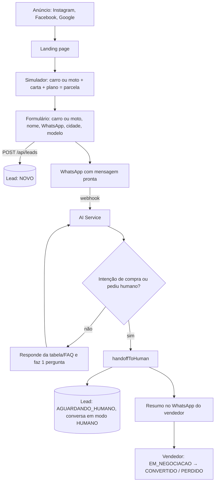

# Arquitetura do funil

## Estados do lead

NOVO → IA_ATENDENDO → QUALIFICADO → AGUARDANDO_HUMANO → EM_NEGOCIACAO → CONVERTIDO | PERDIDO

## Dados coletados pela IA (sem repetir o que já sabe)

nome, cidade, WhatsApp (vem do próprio canal), carro ou moto, modelo, valor da carta, plano, faixa de parcela (só se não souber a carta), se já tem veículo, se quer trocar (só se já tem), se quer vendedor.
